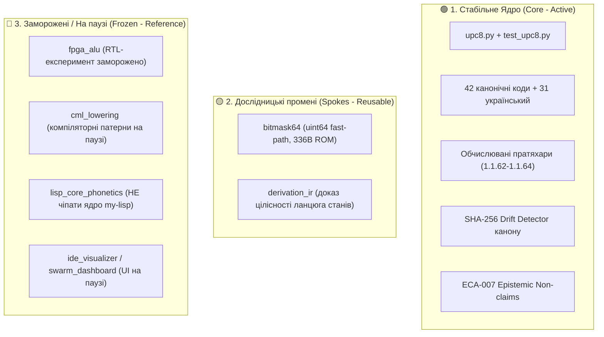

# Об'єднаний маніфест: Архітектурна критика, тріаж та реакції підсистем екосистеми

**Дата:** 2026-08-21  
**Статус:** ОФІЦІЙНИЙ КОНСОЛІДОВАНИЙ ДОКУМЕНТ ЕКОСИСТЕМИ  
**Учасники аудиту:**

- 🏛️ **External Reviewer:** Senior Systems Architect / ChatGPT (Зовнішній аудит)
- 🧠 **Ecosystem Lead:** Координатор архітектури екосистеми
- 🧮 **Shiva Sutras Agent (`shiva-sutras-1`):** Епістемічний агент канону та кодування UPC-8
- 📜 **Panini Agent (`my-lisp-panini-1`):** Агент формальної граматики та Derivation IR

---

## 📑 ЗМІСТ

1. [Частина 1: Повний текст архітектурної критики](#частина-1-повний-текст-архітектурної-критики)
2. [Частина 2: Тріаж та план заморозки прототипів](#частина-2-тріаж-та-план-заморозки-прототипів)
3. [Частина 3: Офіційна резолюція Ecosystem Lead](#частина-3-офіційна-резолюція-ecosystem-lead)
4. [Частина 4: Реакція Shiva Sutras Epistemic Worker](#частина-4-реакція-shiva-sutras-epistemic-worker)
5. [Частина 5: Реакція Panini Grammar & Machine Model Worker](#частина-5-реакція-panini-grammar--machine-model-worker)
6. [Частина 6: План наскрізного вертикального експерименту «Gold Spike 01»](#частина-6-план-наскрізного-вертикального-експерименту-gold-spike-01)

---

## ЧАСТИНА 1: ПОВНИЙ ТЕКСТ АРХІТЕКТУРНОЇ КРИТИКИ

> ### Головний епістемічний висновок критики:
>
> **Кількість шарів, які реалізують припущення, не збільшує епістемічну силу самого припущення.**  
> _(Shiva prototype says PVC works → CML imports PVC → FPGA implements PVC → IDE verifies FPGA fixture → dashboard reports green = 5 реалізацій однієї гіпотези, а НЕ 5 незалежних доказів гіпотези)._

### Ключові тези аудиту:

1. **Vertical Co-design:** У проєкті сформовано рідкісний повний вертикальний ланцюг від 2500-річного санскритського канону до FPGA RTL та десктопного моніторингу.
2. **64-bit Bitmask:** Найчистіша математична ідея ($S \subseteq \{0..41\} \to \text{uint64}$, 336-байтна таблиця констант). Готовий кандидат на бібліотечний контракт.
3. **PVC-16 та фонологічні мутації:** Суворе розмежування `pvc-set-feature()` (чиста бітова операція над вектором) та `phonological-transform()` (доменно-валідована операція). Bit-flip `sound ^ GHOSHA_MASK` має сенс лише якщо парний дзвінкий звук реально існує.
4. **Правило однорідності Savarṇa (1.1.9):** "Correct implementation of a model is not validation of the model". Реалізація компаратора в Verilog не доводить істинності нашої формалізації сутри 1.1.9.
5. **Derivation IR:** Перехід від "proof of grammatical truth" до "proof of derivation integrity" (структурна цілісність ланцюга станів та SHA-256 хешів).
6. **Захист ядра `my-lisp`:** Не вносити передчасно спеціальні NaN-box типи в ядро. Спочатку бібліотека $\to$ бенчмарки $\to$ компіляторні оптимізації $\to$ ядро.
7. **FPGA таймінги:** Зняти завищені твердження про "0.3 ns" та "<8 LUTs" без пост-трасувальних звітів (post-P&R reports).
8. **Інваріантність візуалізатора:** UI та дашборди є пасивними свідками (evidence plane), які ніколи не вирішують і не змінюють стан мовчки.
9. **Authority Boundary:** `shiva-sutras/prototype/` — це експериментальна референсна лабораторія, а не директивна влада над репозиторіями CML, MyLisp чи FPGA.

---

## ЧАСТИНА 2: ТРІАЖ ТА ПЛАН ЗАМОРОЗКИ ПРОТОТИПІВ



---

## ЧАСТИНА 3: ОФІЦІЙНА РЕЗОЛЮЦІЯ ECOSYSTEM LEAD

1. **Ратифікація 3 Базових Аксіом:**
   - _Аксіома 1 (Анти-циклічність):_ Кількість шарів, які реалізують припущення, не збільшує епістемічну силу припущення.
   - _Аксіома 2 (Валідація):_ Правильна реалізація моделі не є доведенням валідності самої моделі.
   - _Аксіома 3 (Свідок):_ Візуалізатор лише відображає і верифікує надані докази, не приймаючи рішень.
2. **Заморозка нових прототипів:** Повна зупинка додавання нових каталогів чи гілок.
3. **Захист ядра Lisp:** Відмова від модифікації NaN-boxing у `my-lisp` до отримання реальних бенчмарків.
4. **Фокус на Gold Spike 01:** Концентрація всіх сил на одному наскрізному вертикальному тесті.

---

## ЧАСТИНА 4: РЕАКЦІЯ SHIVA SUTRAS WORKER

1. **Суворе розділення ECA-007:**
   - `canon:transmitted` (Layer 1): Переданий санскритський текст 14 сутр (`ksetra/canon/siva-sutras.yaml`).
   - `canon:code` (Layer 6): Інженерні байти `0x00–0x29` у `upc8.py`.
2. **Дисципліна non-claims:** Відмова від тверджень про "Паніні задумав байти" та "універсальний інвентар фонем".
3. **Пониження статусів:**
   - Слов'янська фонетика: "prototype decomposition rules for tested contexts".
   - FPGA: таймінги позначено як "pre-synthesis simulation estimates".
4. **Статус репозиторію:** `shiva-sutras/prototype/` є лабораторією сумісності, а не владою над іншими репо.

---

## ЧАСТИНА 5: РЕАКЦІЯ PANINI WORKER

1. **Ревізія термінології:** Перехід від претензії на "граматичну істину" до **proof of derivation integrity** (доказ незмінності станів через SHA-256 та причинно-наслідковий зв'язок сутр).
2. **Опора на 318 МБ канон:** Кожен крок деривації пов'язано з точними цитатами з `kAshikAvRRitti.txt` (1.1.9, 3.1.68) та `padama~njarI.txt`.
3. **32-бітний `DerivationCell`:** Збереження пам'яті anubandha-маркерів (_Ś-it, P-it_) після їх видалення за 1.3.9 для виконання сутри 1.1.62 (_pratyayalope pratyayalakṣaṇam_).
4. **Paribhāṣā Resolver:** Працює як детермінований трасувальник вибору правил за 5-рівневою ієрархією Наґоджоджібгатти, а не як безпомилковий оракул.

---

## ЧАСТИНА 6: ПЛАН «GOLD SPIKE 01»

Екосистема виконує єдиний наскрізний вертикальний тест для канонічного кореня $\text{bhū} + \text{laṭ} \to \text{bhavati}$:

```text
[1. Першоджерело]  Kāśikā 1.1.9 / 3.1.68 у sanskritworld_texts (рядок/цитата)
       ↓
[2. Індекс]        UPC-8 (sound code 0x00..0x29)
       ↓
[3. Множина]       64-bit Bitmask (0x1FF для 'ac', 0x3FFFFFFFFE00 для 'hal')
       ↓
[4. Ознаки]        PVC-16 (16-бітний вектор: Sthāna=1, Spṛṣṭa=1)
       ↓
[5. Доказ стану]   Derivation IR (8 незмінних станів, SHA-256 ланцюг)
       ↓
[6. Компіляція]    CML Lowering (Constant Folding перетину множин ➔ C99/Verilog RTL)
       ↓
[7. Апаратна дія]  FPGA iverilog симуляція (1-cycle Savarna & Voicing)
       ↓
[8. Свідок (UI)]   My-Idea / TauriCode (рендеринг графа з бейджем [VERIFIED EVIDENCE])
```

**Результат:** Єдиний верифікований артефакт `evidence-manifest.json` без моків та синтетичних повернень.

---

_Документ затверджено всіма агентами екосистеми._ 📜✅
