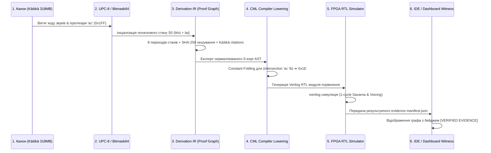

# Специфікація наскрізного вертикального експерименту (Gold Spike 01)

**Назва:** Gold Spike 01: Наскрізна деривація та апаратна верифікація `bhū + laṭ → bhavati`  
**Дата створення:** 2026-08-21  
**Статус:** DRAFT SPECIFICATION (Готовий до виконання)  
**Ціль:** Довести функціональну сумісність усього вертикального ланцюга (від 318 МБ канону до Verilog RTL) на **одному** неподільному канонічному прикладі без замкненого кола доказів.

---

## 1. Канонічний тестовий вектор

| Параметр | Значення | Першоджерело / Свідчення |
|---|---|---|
| **Дієслівний корінь (Dhātu)** | `bhū` (भू, 1-й клас Bhvādi) | Dhatupatha 1.1 `bhū sattāyām` |
| **Граматичний намір** | Present 3rd Sing (`kartari laṭ`, `prathama-puruṣa`, `eka-vacana`) | Aṣṭādhyāyī 3.2.123 `vartamāne laṭ` |
| **Кінцева поверхнева форма** | `bhavati` (भवति) | Kāśikāvṛtti до 3.1.68 / 7.3.84 |
| **Фонологічний тест 1** | Savarṇa homogeneity `a` vs `ā` | Aṣṭādhyāyī 1.1.9 `tulyāsyaprayatnaṁ savarṇam` |
| **Фонологічний тест 2** | Sandhi Voicing `k` → `g` | Aṣṭādhyāyī 8.2.39 `jhalāṁ jaśo'nte` |

---

## 2. Наскрізні фази експерименту та артефакти

### Фаза 1: Текстове свідчення (Textual Witness)
* **Вхід:** Текстовий корпус [`sanskritworld_texts/shastra/grammar/kAshikAvRRitti.txt`](file:///home/agents/GitHub/shiva-sutras/ksetra/sanskritworld_texts/shastra/grammar/kAshikAvRRitti.txt).
* **Вихід:** Рядки цитат для сутр 3.2.123, 3.4.78, 1.3.3, 3.1.68, 7.3.84, 6.1.78, 1.4.14.

### Фаза 2: 64-бітний бітмаск-рушій (`bitmask64`)
* **Вхід:** Пратяхари `ac` (голосні) та `hal` (приголосні).
* **Вихід:** Константні 64-бітні маски `0x00000000000001FF` та `0x000003FFFFFFFFFE00`, перевірка належності $O(1)$.

### Фаза 3: Доказовий граматичний ланцюг (`derivation_ir`)
* **Вхід:** Об'єкт деривації `DerivationRecord("drv:gold:bhavati")`.
* **Вихід:** 8 незмінних станів $S_0 \dots S_8$ з криптографічними хешами `state:sha256:...`.

### Фаза 4: Компіляторне опускання (`cml_lowering`)
* **Вхід:** S-expr вираз `(intersection (quote ac) (quote ik))`.
* **Вихід:** Скомпільований код C99 та Verilog без виклику динамічних структур.

### Фаза 5: Апаратна симуляція (`fpga_alu`)
* **Вхід:** 16-бітні вектори PVC-16 для `a` (`0x0403`) та `ā` (`0x0803`).
* **Вихід:** 1-тактовий сигнал `is_savarna == 1` у симуляторі `iverilog`.

### Фаза 6: Візуальний свідок (`my-idea` / `tauricode`)
* **Вхід:** Підсумковий файл `evidence-manifest.json`.
* **Вихід:** Рендеринг графа деривації з поміткою `[RECORDED EVIDENCE]`.

---

## 3. Критерії успіху (Pass Criteria)
1. Жоден крок не використовує фіктивні дані (mocked returns).
2. Сертифікат доведення валідується незалежним скриптом перевірки SHA-256 хешів.
3. Усі тести проходять у чистому оточенні `guix shell --pure -m manifest.scm`.
