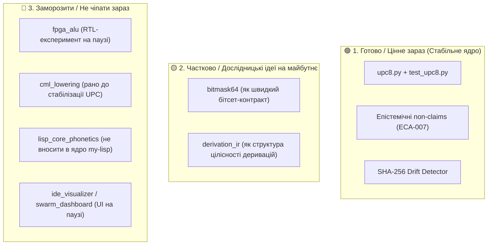

# Детальний розбір та тріаж каталогу `prototype/`

**Дата:** 2026-08-21  
**Статус:** РАТИФІКОВАНИЙ ТРІАЖ ТА ПЛАН ЗАМОРОЗКИ (Priority & Freeze Matrix)  
**Епістемічний шар:** Layer 6 (Engineering Reference Lab)  
**Область:** `shiva-sutras/prototype/` та екосистемні прототипи

---

## 1. Епістемічний статус (Головне)

README прямо фіксує:

> **experimental / engineering, not a research or hardware result**

Прототип **НЕ** претендує на:

1. Історичне кодування, яке «мав на увазі Паніні» (відсутність анахронізмів).
2. Універсальний інвентар усіх людських фонем (лише дискретні множини цільових мов).
3. FPGA performance result (симуляція ≠ виміряне залізо).

> **Критична межа:** «Canonical» тут = **інженерне призначення базових кодів** (`canon:code`), а **не переданий канон** (`canon:transmitted`). Це дотримання контракту ECA-007.

---

## 2. Анатомія каталогу: Ядро проти променів

```text
prototype/
├── upc8.py + test_upc8.py          ← СПРАВЖНЄ ЯДРО UPC-8
├── UPC8-documentation-ua.md
├── bitmask64/                      pratyāhāra як 64-bit mask (чисте математичне розширення)
├── derivation_ir/                  IR деривацій + proof certificates (окремий граматичний стек)
├── lisp_core_phonetics/            міст у Lisp / .my (бібліотечний рівень)
├── fpga_alu/                       Verilog ALU + testbench (гіпотетичне RTL-продовження)
├── cml_lowering/                   lowering у бік cml (компіляторний патерн)
├── slavic_phonetics/               слов’янські розширення (дослідницька модель)
├── ide_visualizer/                 візуалізація (інструмент-свідок)
└── swarm_dashboard/                UI рою (інфраструктурний монітор)
```

Це не «один монолітний прототип», а **віяло інженерних променів навколо UPC-8**.

---

## 3. Справжнє ядро: UPC-8 (`upc8.py`)

**Діапазони кодів:**

- `0x00–0x29`: **Canonical** (42 звуки канону в порядку Шіва-сутр).
- `0x2A–0x30`: **Sanskrit extended** (довгі голосні, anusvāra, visarga).
- `0x31–0x4F`: **Ukrainian** (31 код + 13 спільних із каноном).
- `0x50–0x7F`: **English** (reserved).
- `0x80–0xFF`: **Future** (reserved).

**Ключові інженерні властивості:**

1. **Ізоляція шарів:** Канон (immutable) $\to$ санскритська інтерпретація $\to$ мовні розширення $\to$ UPC-8 кодування.
2. **Обчислювана пратяхара:** Працює за правилами Паніні 1.1.62–1.1.64, а не за статичними хардкод-списками.
3. **Drift Detector (`CANON_SOURCE_SHA256`):** Гучний детектор розходження між YAML-каноном та кодом.
4. **Коректний аліасинг:** Звук `h` (сутри 5 і 14) має єдиний код `0x09`.

---

## 4. Головна небезпека: Розростання міні-екосистеми

Головний ризик — виникнення ілюзії, що наявність 9 каталогів уже формує «доведену вертикаль»:

$$\text{Śiva Sūtras canon} \neq \text{phonological interpretation} \neq \text{UPC-8 encoding} \neq \text{FPGA ALU}$$

Якщо змішати ці 4 рівні в одне ціле — з'явиться хибне відчуття, ніби залізо «підтверджує Паніні».

---

## 5. Матриця пріоритетів і план заморозки (Actionable Triage)



### Директива:

1. **Зупинити розширення прототипів.**
2. Тримати фокус виключно на **UPC-8 як компактному, строгому інженерному кодуванні**.
3. Не намагатися форсовано протягувати його на ПЛІС чи в ядро `my-lisp` без окремої експериментальної потреби.
